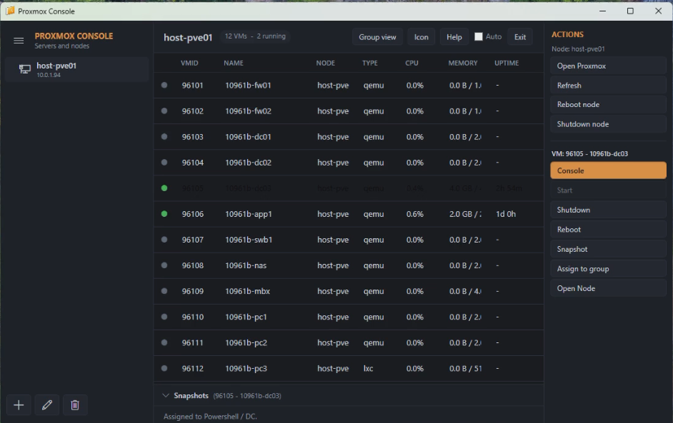
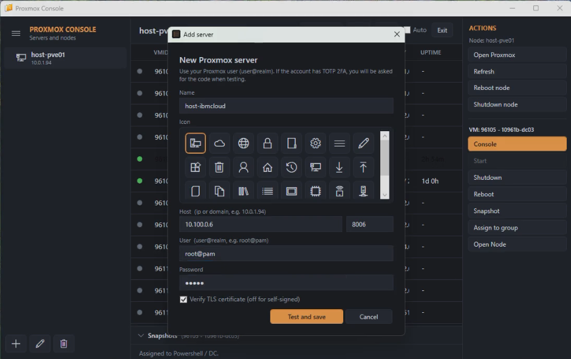
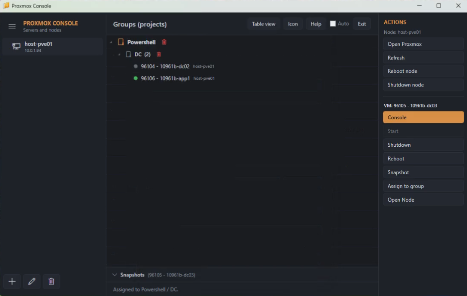

# Proxmox Console

A native Windows desktop application to manage **Proxmox VE** servers from a clean, Hyper-V–style interface: browse servers and nodes, manage virtual machines, open the embedded noVNC console, take snapshots, and organize your VMs into projects — all from one window.

*Una aplicación de escritorio nativa para Windows que permite administrar servidores **Proxmox VE** desde una interfaz limpia al estilo Hyper-V: explora servidores y nodos, gestiona máquinas virtuales, abre la consola noVNC integrada, toma snapshots y organiza tus VMs en proyectos, todo desde una sola ventana.*

---

## 📸 Screenshots / Capturas

> _Add your screenshots here / Coloca aquí tus capturas:_

<!-- Main window -->


<!-- Embedded console -->


<!-- Group view -->

<!-- Shell View -->


---

## ✨ Features / Características

**English**

- Manage multiple Proxmox servers and their nodes from a tree view.
- VM table with status, CPU, memory and uptime, with one-click filtering by node.
- Hyper-V–style **Actions panel**: node actions (reboot / shutdown) and per-VM actions (Console, Start, Shutdown, Reboot).
- **Embedded noVNC console and Proxmox web portal** (no external browser needed).
- **Snapshots**: take, roll back and delete, from a collapsible panel.
- **Groups**: organize VMs into Project / Subproject (defined in the app, not in Proxmox).
- **Custom icon**: pick the window/taskbar icon from a bundled icons folder.
- **System tray**: minimize to tray; restore with a click; group VM consoles under a single taskbar icon.
- **2FA (TOTP)** support and secure credential storage (Windows DPAPI).
- Self-contained installer that also installs the required runtime automatically.

**Español**

- Administra varios servidores Proxmox y sus nodos desde un árbol.
- Tabla de VMs con estado, CPU, memoria y tiempo encendido, con filtrado por nodo en un clic.
- **Panel de acciones** estilo Hyper-V: acciones de nodo (reiniciar / apagar) y por VM (Consola, Iniciar, Apagar, Reiniciar).
- **Consola noVNC y portal web de Proxmox integrados** (sin navegador externo).
- **Snapshots**: crear, revertir y eliminar desde un panel plegable.
- **Grupos**: organiza las VMs en Proyecto / Subproyecto (definido en la app, no en Proxmox).
- **Icono personalizable**: elige el icono de la ventana/barra de tareas desde una carpeta de iconos incluida.
- **Bandeja del sistema**: minimiza al tray; restaura con un clic; agrupa las consolas bajo un solo icono.
- Soporte **2FA (TOTP)** y almacenamiento seguro de credenciales (Windows DPAPI).
- Instalador autosuficiente que además instala el runtime necesario automáticamente.

---

## 🧩 Requirements / Requisitos

**To run / Para ejecutar**

- Windows 10 / 11 (64-bit).
- The installer automatically installs the **Microsoft Visual C++ 2015–2022 Redistributable (x64)** if it is missing. / El instalador instala automáticamente el **Microsoft Visual C++ 2015–2022 Redistributable (x64)** si falta.

**To build / Para compilar**

- Visual Studio 2022.
- .NET Framework 4.8.
- NuGet packages: `CefSharp.Wpf` (141.x), `Newtonsoft.Json` (13.x).
- Build platform: **x64**.

---

## 🚀 Installation / Instalación

**For users / Para usuarios**

1. Download the latest `ProxmoxConsole_Setup_x.x.x.exe` from the [Releases](../../releases) page. / Descarga el último `ProxmoxConsole_Setup_x.x.x.exe` desde [Releases](../../releases).
2. Run it (administrator rights required, it installs to `Program Files`). / Ejecútalo (requiere permisos de administrador; se instala en `Program Files`).
3. Launch **Proxmox Console**. / Abre **Proxmox Console**.

Your configuration is stored per user in `%AppData%\ProxmoxConsole`, with passwords encrypted via Windows DPAPI. / Tu configuración se guarda por usuario en `%AppData%\ProxmoxConsole`, con las contraseñas cifradas mediante Windows DPAPI.

---

## 🛠️ Build from source / Compilar desde el código

```text
1. Open the solution in Visual Studio 2022.
2. Restore NuGet packages (CefSharp.Wpf, Newtonsoft.Json).
3. Set the build configuration to Release | x64.
4. Build > Rebuild Solution.
5. The executable is generated in: bin\x64\Release\ProxmoxConsole.exe
```

To build the installer, open `ProxmoxConsole.iss` with [Inno Setup](https://jrsoftware.org/isdl.php) and compile (F9). Place `vc_redist.x64.exe` next to the `.iss` first. / Para crear el instalador, abre `ProxmoxConsole.iss` con [Inno Setup](https://jrsoftware.org/isdl.php) y compila (F9). Coloca antes `vc_redist.x64.exe` junto al `.iss`.

---

## 📖 Usage / Uso

**English**

1. Click **+** to add a Proxmox server (host, port, user@realm, password; TOTP if enabled).
2. Select a server to list all its VMs, or a node to filter that node.
3. Select a VM and use the **Actions** panel on the right (Console, Start, Shutdown, Reboot, Snapshot, Assign to group).
4. Use the bottom **Snapshots** panel to manage snapshots of the selected VM.
5. Switch to **Group view** to see your VMs organized by Project / Subproject.

**Español**

1. Pulsa **+** para añadir un servidor Proxmox (host, puerto, usuario@realm, contraseña; TOTP si está activo).
2. Selecciona un servidor para listar todas sus VMs, o un nodo para filtrar ese nodo.
3. Selecciona una VM y usa el panel **Actions** de la derecha (Consola, Iniciar, Apagar, Reiniciar, Snapshot, Asignar a grupo).
4. Usa el panel inferior de **Snapshots** para gestionar los snapshots de la VM seleccionada.
5. Cambia a **Group view** para ver tus VMs organizadas por Proyecto / Subproyecto.

---

## 🔒 Security notes / Notas de seguridad

- Passwords are stored encrypted with **Windows DPAPI**, tied to the current Windows user account. / Las contraseñas se guardan cifradas con **Windows DPAPI**, ligadas a la cuenta de Windows actual.
- Grouping data lives only on your machine (`groups.json`) and never touches Proxmox. / Los datos de agrupación viven solo en tu equipo (`groups.json`) y no tocan Proxmox.

---

## 🤝 Contributing / Contribuciones

Issues and pull requests are welcome. / Se aceptan issues y pull requests.

---

## 📄 License / Licencia

This project is licensed under the **MIT License** — see the [LICENSE](LICENSE) file for details. / Este proyecto está bajo la **Licencia MIT**; consulta el archivo [LICENSE](LICENSE).

---

## 👤 Author / Autor

**Luis Leonel Gomez Alvarez**

Copyright © 2026 Luis Leonel Gomez Alvarez

[LinkedIn](https://www.linkedin.com/in/luis-leonel-gomez-alvarez-b2aaba237)

---

> Proxmox® and Proxmox VE® are trademarks of Proxmox Server Solutions GmbH. This project is an independent tool and is not affiliated with or endorsed by Proxmox. / Proxmox® y Proxmox VE® son marcas de Proxmox Server Solutions GmbH. Este proyecto es una herramienta independiente y no está afiliada ni respaldada por Proxmox.
